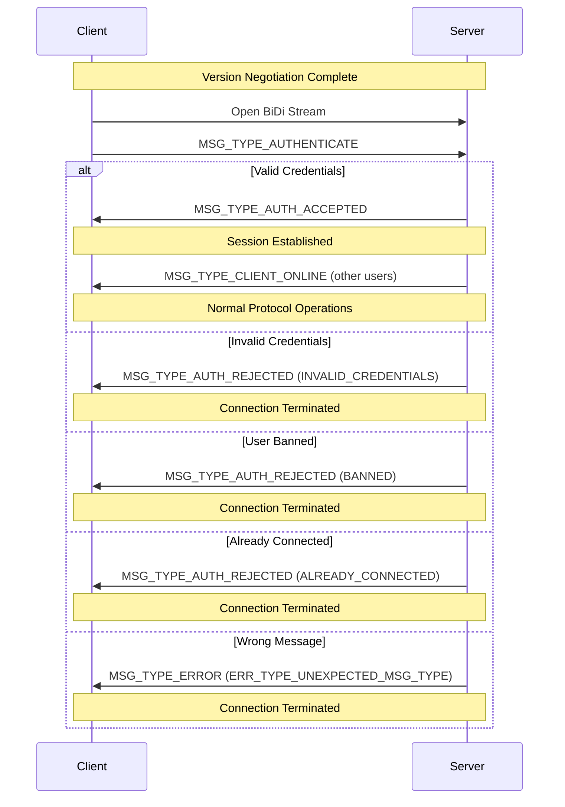

After successful version negotiation, clients must authenticate with the server before they can use any protocol features. Authentication establishes a session and verifies the client's identity.

## Authentication Flow

The handshake stage must occur **immediately** after the protocol version is negotiated:

<Steps>
  <Step title="Client Opens BiDi Stream">
    The client opens a new bidirectional stream for authentication.
    
    <Info>This is a separate stream from the version negotiation stream.</Info>
  </Step>
  
  <Step title="Client Sends Credentials">
    The client sends a `MSG_TYPE_AUTHENTICATE` message with its credentials:
    
    ```protobuf
    message MsgAuthenticate {
        string room = 1;      // The room to join
        string username = 2;  // The user's username
        string password = 3;  // The user's password
    }
    ```
  </Step>
  
  <Step title="Server Validates Credentials">
    The server validates the provided credentials and responds with one of:
    
    - `MSG_TYPE_AUTH_ACCEPTED` - Authentication successful
    - `MSG_TYPE_AUTH_REJECTED` - Authentication failed
    - `MSG_TYPE_ERROR` with `ERR_TYPE_UNEXPECTED_MSG_TYPE` - Wrong message received
  </Step>
  
  <Step title="Session Established or Connection Terminated">
    - If accepted: Session is established, client can now use protocol features
    - If rejected: Connection is terminated
  </Step>
</Steps>

<Warning>
Any errors in the handshake process, including invalid credentials, will result in **immediate connection termination**.
</Warning>

## Authentication Messages

### Authentication Request

Clients send their credentials using `MSG_TYPE_AUTHENTICATE`:

```protobuf
message MsgAuthenticate {
    // The room the user is trying to authenticate with.
    string room = 1;

    // The user's username.
    string username = 2;

    // The user's password.
    string password = 3;
}
```

<Note>
FriendNet uses room-based authentication. Users authenticate to a specific room and can only interact with other users in that room.
</Note>

### Authentication Accepted

When authentication succeeds, the server responds:

```protobuf
message MsgAuthAccepted {
    // Empty - authentication successful
}
```

<Info>
Once the client receives `MSG_TYPE_AUTH_ACCEPTED`, the connection is considered authenticated and a session has been established. The client can now send protocol messages and will receive server notifications.
</Info>

### Authentication Rejected

When authentication fails, the server responds:

```protobuf
message MsgAuthRejected {
    // The reason the authentication request was rejected
    AuthRejectionReason reason = 1;

    // Optional human-readable message
    optional string message = 2;
}
```

## Rejection Reasons

The `AuthRejectionReason` enum defines why authentication was rejected:

<AccordionGroup>
  <Accordion title="AUTH_REJECTION_REASON_UNSPECIFIED (0)" icon="question">
    **No specific reason provided**
    
    More details may be available in the rejection message field. This is a fallback reason when no specific code applies.
  </Accordion>
  
  <Accordion title="AUTH_REJECTION_REASON_INVALID_CREDENTIALS (2)" icon="key">
    **Invalid credentials**
    
    The provided username, password, or room credentials were invalid. This could mean:
    - Wrong password
    - Non-existent username
    - Invalid room
    - Malformed credentials
  </Accordion>
  
  <Accordion title="AUTH_REJECTION_REASON_BANNED (3)" icon="ban">
    **User is banned**
    
    The user has been banned from the server or room and is not allowed to connect.
  </Accordion>
  
  <Accordion title="AUTH_REJECTION_REASON_ALREADY_CONNECTED (4)" icon="users">
    **Already connected**
    
    A client with the same username is already connected to the room. FriendNet does not allow multiple simultaneous connections with the same username.
  </Accordion>
</AccordionGroup>

## Timeout Handling

If the handshake is not completed within a server-defined timeout, the connection will be terminated without providing a reason.

- The server will attempt to send error or rejection messages before closing
- If a message send timeout is reached, the connection terminates regardless
- Clients should implement their own timeout handling

<Warning>
After receiving `MSG_TYPE_AUTH_REJECTED`, the client will be disconnected. The client must address the rejection reason before attempting to reconnect.
</Warning>

## Ping Restriction During Authentication

<Warning>
The client will **not** receive any `MSG_TYPE_PING` messages during the handshake, and it should **not** send any `MSG_TYPE_PING` messages during this phase.
</Warning>

Ping/pong messages are only used after authentication is complete.

## Session Establishment

Once authenticated, the client has an active session and can:

<CardGroup cols={2}>
  <Card title="Send Protocol Messages" icon="paper-plane">
    - Request online users
    - Search for files
    - Request proxy connections
    - Change account password
  </Card>
  
  <Card title="Receive Server Notifications" icon="bell">
    - Client online/offline events
    - Inbound proxy streams
    - Search results
    - Ping requests
  </Card>
</CardGroup>

## Message Sequence Diagram



## Security Considerations

<Warning>
**Credential Transmission**: Passwords are transmitted in plaintext within the protocol message. Always use the protocol over QUIC/TLS to ensure credentials are encrypted in transit.
</Warning>

<Info>
FriendNet uses QUIC, which provides built-in TLS 1.3 encryption for all data including authentication credentials. Credentials are never transmitted unencrypted over the network.
</Info>

### Best Practices

<Steps>
  <Step title="Use Strong Passwords">
    Encourage users to use strong, unique passwords for their FriendNet accounts.
  </Step>
  
  <Step title="Implement Rate Limiting">
    Servers should implement rate limiting on authentication attempts to prevent brute-force attacks.
  </Step>
  
  <Step title="Handle ALREADY_CONNECTED">
    Clients should gracefully handle the `ALREADY_CONNECTED` rejection and inform users that they may already be logged in elsewhere.
  </Step>
  
  <Step title="Secure Credential Storage">
    Never store passwords in plaintext. If persisting credentials, use secure storage mechanisms.
  </Step>
</Steps>

## Changing Password

After authentication, authenticated clients can change their account password using `MSG_TYPE_CHANGE_ACCOUNT_PASSWORD`:

```protobuf
message MsgChangeAccountPassword {
    // The client's current account password
    string current_password = 1;

    // The new password (must not be empty)
    string new_password = 2;
}
```

Expected responses:
- `MSG_TYPE_ACKNOWLEDGED` - Password changed successfully
- `MSG_TYPE_ERROR` with `ERR_TYPE_PERMISSION_DENIED` - Current password incorrect
- `MSG_TYPE_ERROR` with `ERR_TYPE_INVALID_FIELDS` - New password doesn't meet requirements

## Implementation Guidelines

<Steps>
  <Step title="Separate Authentication Stream">
    Use a new BiDi stream for authentication, separate from version negotiation.
  </Step>
  
  <Step title="Handle All Response Types">
    Clients must handle:
    - `MSG_TYPE_AUTH_ACCEPTED`
    - `MSG_TYPE_AUTH_REJECTED` (all reasons)
    - `MSG_TYPE_ERROR`
    - Connection timeout
  </Step>
  
  <Step title="Store Session State">
    After successful authentication, store the authenticated username and room for use in subsequent operations.
  </Step>
  
  <Step title="Implement Reconnection Logic">
    Handle disconnections gracefully and implement automatic reconnection with proper backoff.
  </Step>
</Steps>

## Next Steps

<CardGroup cols={2}>
  <Card title="Protocol Overview" icon="diagram-project" href="/protocol/overview">
    Return to the protocol overview
  </Card>
  
  <Card title="Paths" icon="folder" href="/protocol/paths">
    Learn about path formatting for file operations
  </Card>
</CardGroup>
