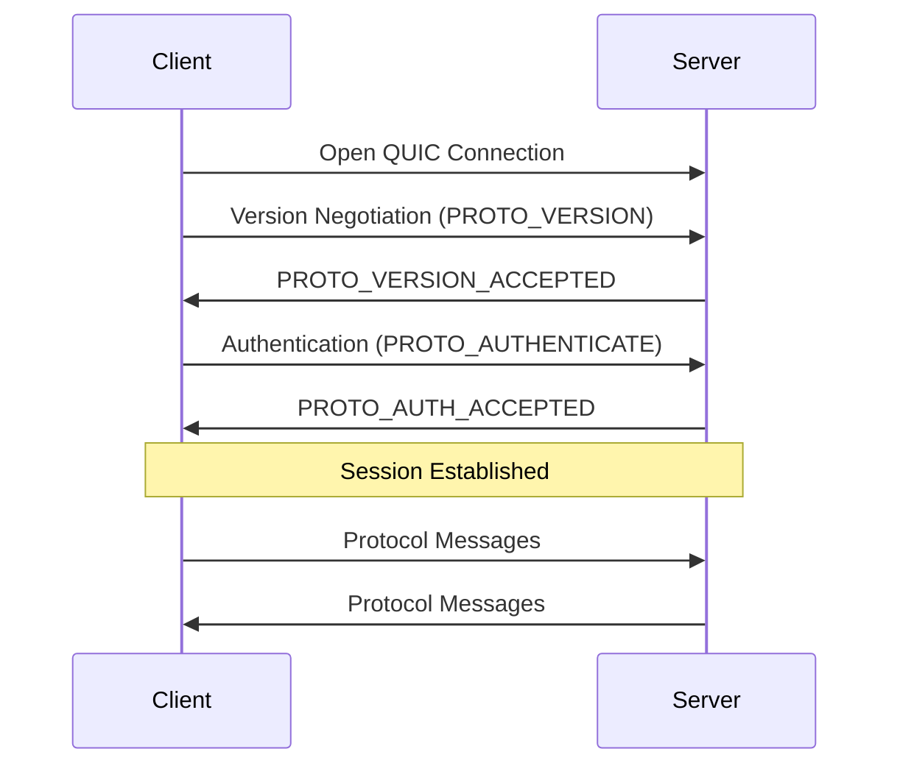

The FriendNet protocol is a QUIC-based communication protocol designed for peer-to-peer file sharing and real-time messaging between clients.

## Architecture

The protocol operates over QUIC, with clients making outbound connections to servers. QUIC provides:

- Built-in encryption and security
- Multiplexed streams over a single connection
- Low-latency connection establishment
- Reliable, ordered delivery

## Request-Response Model

The protocol is primarily based on a simple request-response model:

1. A request is initiated by creating a BiDi (bidirectional) stream
2. The opener writes a protocol message immediately to the stream
3. After receiving the initial message, the receiver can:
   - Send back a reply
   - Read additional data (if applicable)
   - Close the stream

<Note>
The protocol uses BiDi streams for all communication, allowing both parties to send and receive data on the same stream.
</Note>

## Message Classes

There are three classes of protocol messages:

<CardGroup cols={3}>
  <Card title="C2S" icon="arrow-right">
    **Client to Server**
    
    Messages sent by the client to the server for authentication, user lists, and server operations.
  </Card>
  
  <Card title="S2C" icon="arrow-left">
    **Server to Client**
    
    Messages sent by the server to the client for responses, notifications, and events.
  </Card>
  
  <Card title="C2C" icon="arrows-left-right">
    **Client to Client**
    
    Messages sent between clients, either directly or proxied through the server.
  </Card>
</CardGroup>

## Ping/Pong Mechanism

Both clients and servers implement a ping/pong keepalive mechanism:

- Either party can send `MSG_TYPE_PING` on a new BiDi stream
- The recipient must respond with `MSG_TYPE_PONG`
- Timestamps are included to measure latency
- Clients should not send pings faster than 1 per second

<Warning>
Failure to respond to a `MSG_TYPE_PING` with `MSG_TYPE_PONG` will result in connection termination.
</Warning>

### Rate Limiting

Servers may reply to `MSG_TYPE_PING` with an `ERR_TYPE_RATE_LIMITED` error if pings are sent too frequently. This should not cause the client to terminate the connection.

Clients are guaranteed not to be rate limited if sending pings at 1 per second or slower.

## Connection Lifecycle

A typical FriendNet connection follows this sequence:

1. **Connection Establishment**: Client opens a QUIC connection to the server
2. **Version Negotiation**: Client and server agree on a protocol version
3. **Authentication**: Client authenticates with credentials
4. **Active Session**: Client and server exchange protocol messages
5. **Termination**: Either party can close the connection

<Info>
No `MSG_TYPE_PING` messages are exchanged during version negotiation or authentication stages.
</Info>

## Proxy Streams

When direct connections between clients are not possible or desired, the server can proxy streams:

- Client requests a proxy to another client via `MSG_TYPE_OPEN_OUTBOUND_PROXY`
- Server opens a stream to the target client with `MSG_TYPE_INBOUND_PROXY`
- All subsequent data is transparently proxied between the two clients
- The server does not read or interpret proxied data

<Warning>
If the server cannot reach the destination client, it will cancel the stream without sending any error message to avoid ambiguity about the message source.
</Warning>

## Next Steps

<CardGroup cols={2}>
  <Card title="Message Layout" icon="code" href="/protocol/message-layout">
    Learn about the binary message format and encoding
  </Card>
  
  <Card title="Version Negotiation" icon="handshake" href="/protocol/version-negotiation">
    Understand the version negotiation process
  </Card>
  
  <Card title="Authentication" icon="key" href="/protocol/authentication">
    Learn about the authentication handshake
  </Card>
  
  <Card title="Paths" icon="folder" href="/protocol/paths">
    Understand path formatting and validation rules
  </Card>
</CardGroup>
