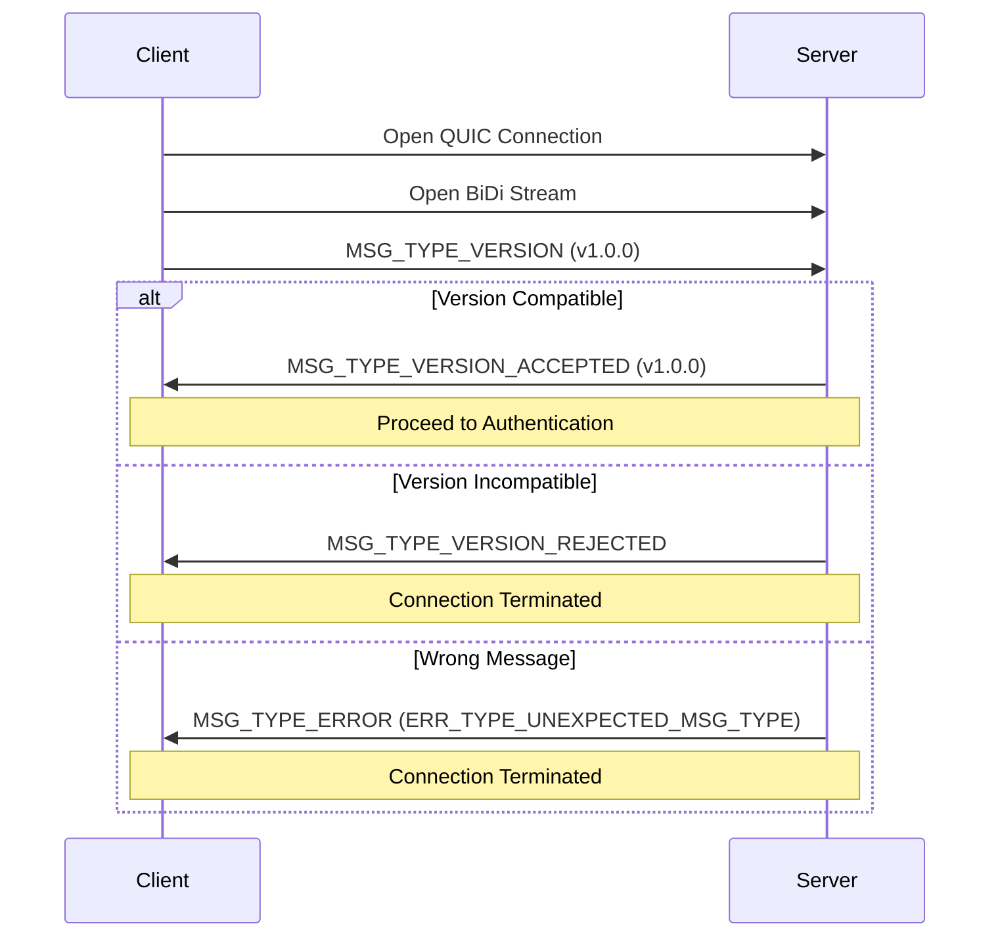

Version negotiation is the first step after a client opens a connection to a FriendNet server. This process ensures both parties can communicate using a mutually compatible protocol version.

## Negotiation Process

The version negotiation stage must occur **immediately** after a connection is opened and follows a strict sequence:

<Steps>
  <Step title="Client Opens BiDi Stream">
    The client initiates version negotiation by opening a new bidirectional stream.
  </Step>
  
  <Step title="Client Sends PROTO_VERSION">
    The client sends a `MSG_TYPE_VERSION` message containing its protocol version.
    
    ```protobuf
    message MsgVersion {
        ProtoVersion version = 1;
    }
    ```
  </Step>
  
  <Step title="Server Responds">
    The server examines the client's version and responds with one of:
    
    - `MSG_TYPE_VERSION_ACCEPTED` - Version is compatible
    - `MSG_TYPE_VERSION_REJECTED` - Version is incompatible
    - `MSG_TYPE_ERROR` with `ERR_TYPE_UNEXPECTED_MSG_TYPE` - Wrong message received
  </Step>
  
  <Step title="Connection Continues or Terminates">
    - If accepted: Client proceeds to authentication
    - If rejected: Connection is terminated
  </Step>
</Steps>

<Warning>
Any errors during version negotiation, including an incompatible version, will result in **immediate connection termination**.
</Warning>

### Timeout Handling

If version negotiation is not completed within a server-defined timeout, the connection will be terminated without providing a reason.

The server will attempt to send error or rejection messages before closing the connection, but will terminate regardless if a message send timeout is reached.

## Protocol Version Format

FriendNet uses semantic versioning with three components:

```protobuf
message ProtoVersion {
    uint32 major = 1;  // Major protocol version
    uint32 minor = 2;  // Minor protocol version  
    uint32 patch = 3;  // Patch protocol version
}
```

The current protocol version can be found in the source code:

```go
// protocol.go:32
var CurrentProtocolVersion = &pb.ProtoVersion{
    Major: 0,
    Minor: 0,
    Patch: 0,
}
```

## Version Semantics

Each version component has specific compatibility guarantees:

<AccordionGroup>
  <Accordion title="PATCH Version" icon="band-aid">
    **Fully backwards compatible additions**
    
    - May introduce new features that are fully backwards compatible
    - Changes must NOT be required for clients to continue working normally
    - Existing functionality remains unchanged
    
    **Example (v1.0.0 → v1.0.1)**:
    - Introduces a new status indicator
    - Clients without this feature continue to work normally
  </Accordion>
  
  <Accordion title="MINOR Version" icon="wrench">
    **Small breaking changes**
    
    - May introduce new features
    - May include small backwards incompatible changes that don't break older clients
    - Must NOT change the handshake process
    
    **Example (v1.0.1 → v1.1.0)**:
    - Introduces a new chat message type (older clients don't understand it)
    - Removes the ability to fetch online users (requests now return empty)
  </Accordion>
  
  <Accordion title="MAJOR Version" icon="rocket">
    **Breaking changes**
    
    - May change anything with no regard to backwards compatibility
    - Exception: Version negotiation process itself must remain stable
    - May rework fundamental protocol aspects
    
    **Example (v1.1.0 → v2.0.0)**:
    - Reworks the handshake process
    - Changes the chat message format
    - Removes unpaginated file fetching
  </Accordion>
</AccordionGroup>

<Note>
The version negotiation process itself **shall not change between versions**, ensuring clients can always attempt to negotiate regardless of version differences.
</Note>

## Version Acceptance

When the server accepts a client's version, it sends:

```protobuf
message MsgVersionAccepted {
    // The server's protocol version
    ProtoVersion version = 1;
}
```

<Info>
Once the version is accepted, the client may safely assume:
- The server supports its protocol version
- All messages it receives will be compatible with its version
- The server will understand all messages it sends

This holds true even if the server reports a different version number.
</Info>

## Version Rejection

When the server rejects a client's version, it sends:

```protobuf
message MsgVersionRejected {
    ProtoVersion version = 1;              // Server's protocol version
    VersionRejectionReason reason = 2;     // Why it was rejected
    optional string message = 3;           // Optional human-readable message
}
```

### Rejection Reasons

| Reason | Code | Description |
|--------|------|-------------|
| `VERSION_REJECTION_REASON_UNSPECIFIED` | 0 | No specific reason (check message field) |
| `VERSION_REJECTION_REASON_TOO_OLD` | 2 | Client version is too old for the server |
| `VERSION_REJECTION_REASON_TOO_NEW` | 3 | Client version is too new for the server |

<Warning>
After receiving `MSG_TYPE_VERSION_REJECTED`, the client will be disconnected and must reconnect with a suitable protocol version.
</Warning>

## Compatibility Expectations

### When Versions Match

If the client and server report the same version:

- Unrecognized messages should be treated as **erroneous behavior**
- All protocol features should work exactly as documented
- No special compatibility handling needed

### When Versions Differ (but accepted)

If versions differ but the server accepts the connection:

<Tabs>
  <Tab title="Client Must">
    ✅ Be prepared to ignore unrecognized messages
    
    ✅ Be prepared to ignore unrecognized fields in known messages
    
    ✅ Handle cases where the server doesn't recognize newer messages
  </Tab>
  
  <Tab title="Server Guarantees">
    ✅ Will understand all messages sent by the client
    
    ✅ Will only send messages compatible with the client's version
    
    ✅ Will support all features available in the client's version
  </Tab>
</Tabs>

### Client Newer Than Server

When the client's version is greater than the server's (but still accepted):

- Client must gracefully handle older server behavior
- Client should not rely on features introduced after the server's version
- Messages unknown to the server may be rejected with `ERR_TYPE_UNEXPECTED_MSG_TYPE`

## Ping Restriction During Negotiation

<Warning>
The client will **not** receive any `MSG_TYPE_PING` messages during version negotiation, and it should **not** send any `MSG_TYPE_PING` messages during this phase.
</Warning>

Ping/pong messages are only used after authentication is complete.

## Message Sequence Diagram



## Implementation Guidelines

<Steps>
  <Step title="Implement Version Comparison">
    Create logic to compare versions using semantic versioning rules.
    
    Reference implementation: `protocol.go:516` (`CompareProtoVersions` function)
  </Step>
  
  <Step title="Handle All Response Types">
    Clients must handle:
    - `MSG_TYPE_VERSION_ACCEPTED`
    - `MSG_TYPE_VERSION_REJECTED`
    - `MSG_TYPE_ERROR`
    - Connection timeout
  </Step>
  
  <Step title="Store Negotiated Version">
    After successful negotiation, store both the client and server versions for compatibility handling throughout the session.
  </Step>
  
  <Step title="Enforce Timeouts">
    Implement reasonable timeouts on both client and server sides to prevent hanging connections.
  </Step>
</Steps>

## Next Steps

<CardGroup cols={2}>
  <Card title="Authentication" icon="key" href="/protocol/authentication">
    Learn about the authentication handshake that follows version negotiation
  </Card>
  
  <Card title="Message Layout" icon="code" href="/protocol/message-layout">
    Understand the message encoding format
  </Card>
</CardGroup>
